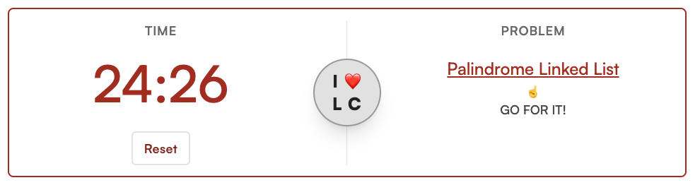

# ❤️ Leetcode

https://leetcode.jasonherngwang.com/

Do you love grinding LeetCode? If so, you're going to love this app. It selects from a pool of 180 problems from [neetcode.io](https://neetcode.io/practice) and other sources. The timer starts immediately so you can experience being in the hot seat.

## Learning Goals
- Practice setting up a 3-tier architecture (web, app, data) on a single node
- Deploy on DigitalOcean Droplet
- Configure Nginx web server and reverse proxy
- Set up SSL
- Play around with Next.js `app`, layouts, `@next/font`
- Learn Prisma to connect with Postgres
- Use Mongoose to work with MongoDB